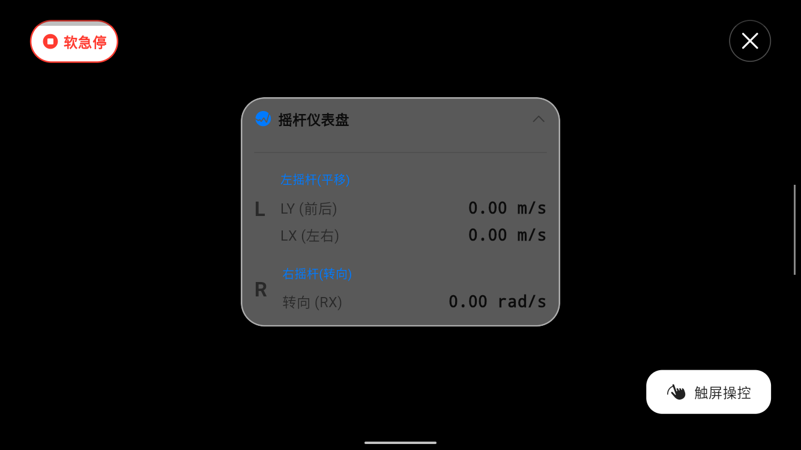

# Handheld Controller (Cross-Platform Quadruped Robot Control Terminal)

[](https://flutter.dev/)


[](https://creativecommons.org/licenses/by-nc/4.0/deed.en)

🌐 **[English](https://github.com/abrahamliu00/handheld_controller/blob/main/README.md)** | **[简体中文](https://github.com/abrahamliu00/handheld_controller/blob/main/README_zh.md)**

This project is a Flutter-based host-computer video transmission and control terminal for quadruped robots.
It pulls video streams via the RTSP protocol and sends control commands to the target IP using the UDP protocol. For the companion receiver ROS package, please see: [retroid_teleop](https://github.com/abrahamliu00/retroid_teleop).



## 📌 Platform Support

The code logic has been isolated for cross-platform compatibility. The actual testing status and system interface limitations for each platform are as follows:
| Platform | Test Status | Input Method | Video Engine | Notes & Limitations |
| :--- | :--- | :--- | :--- | :--- |
| **Android** | ✅&nbsp;Verified | Gamepad / Touch | `media_kit` | Adapted for Retroid Pocket 4 (`com.retroid.gamepad/events`). **Supports in-app Wi-Fi settings.** |
| **Windows** | ✅&nbsp;Verified | WASD / Mouse | `media_kit` | Maps to W/A/S/D. **No in-app Wi-Fi settings.** |
| **Linux** | ⏳&nbsp;Pending | WASD / Mouse | `media_kit` | Requires `libmpv`. **No in-app Wi-Fi settings.** |
| **macOS** | ⏳&nbsp;Pending | WASD / Mouse | `media_kit` | Not physical tested. **No in-app Wi-Fi settings.** |
| **iOS** | ⏳&nbsp;Pending | Touch | `media_kit` | Requires `Info.plist` network config. **No in-app Wi-Fi settings.** |

## 🛠️ Network Topology Requirements

The system network requirements are as follows:
- **Default Environment:** It is recommended that the controller and the controlled device be on the same Local Area Network (LAN).
- **Cross-Subnet/WAN Control:** The code does not restrict devices to the same subnet. As long as the target IP is reachable (e.g., via VPN or port forwarding), the application can send data directly to the corresponding WAN IP.

## 🔌 UDP Communication Protocol & Data Frame

Control commands are sent via UDP. Data is encoded in **Little-Endian** format.
- **Default Target IP:** `192.168.2.129`
- **Default Target Port:** `12121`

The controller sends a fixed-length **42-byte** data packet each time, which the receiver parses via `recvfrom`.

| Offset (Byte) | Type     | Description                     | Data Processing Logic                                                                             |
|:--------------|:---------|:--------------------------------|:--------------------------------------------------------------------------------------------------|
| `0 - 1`       | `UInt8`  | Frame Header Flag               | Fixed as `0x55 0x66`                                                                              |
| `2`           | `UInt8`  | Reserved                        | `0x00`                                                                                            |
| `3 - 4`       | `UInt16` | Data Body Length                | `32`                                                                                              |
| `5 - 6`       | `UInt16` | Reserved                        | `0`                                                                                               |
| `7`           | `UInt8`  | Protocol Version/Flag           | `0x01`                                                                                            |
| `8 - 9`       | `UInt16` | CRC Checksum                    | Byte accumulation sum from Byte 10 to Byte 41                                                     |
| `10 - 23`     | `-`      | Reserved                        | Default empty / 0                                                                                 |
| `24 - 25`     | `Int16`  | Soft E-Stop / Physical B Button | Pressed state is `1`, released is `0`                                                             |
| `26 - 29`     | `-`      | Reserved                        | Default empty / 0                                                                                 |
| `30 - 31`     | `Int16`  | `LX` (Left Stick X-Axis)        | Translation: Range `[-1.0, 1.0]`, transmitted value is `LX * 1000`                                |
| `32 - 33`     | `Int16`  | `LY` (Left Stick Y-Axis)        | Forward/Backward: Range `[-1.0, 1.0]`, transmitted value is `LY * 1000`                           |
| `34 - 35`     | `Int16`  | `RX` (Right Stick X-Axis)       | Rotation: Range `[-1.0, 1.0]`, transmitted value is `RX * 1570` (Corresponding to max 1.57 rad/s) |
| `36 - 37`     | `Int16`  | `RY` (Right Stick Y-Axis)       | Spare: Range `[-1.0, 1.0]`, transmitted value is `RY * 1000`                                      |
| `38 - 41`     | `-`      | Tail Reserved                   | Default empty / 0                                                                                 |

## 📦 Quick Start

**1. Get Code & Dependencies**

Clone repository:
```bash
git clone https://github.com/abrahamliu00/handheld_controller.git
```
Navigate to directory:
```bash
cd handheld_controller 
```
Get Flutter dependencies:
```bash
flutter pub get
```

**2. Build for Corresponding Platforms**

Build Android APK:
```bash
flutter build apk --release
```
Build Windows Desktop:
```bash
flutter build windows --release
```
## 🙏 Acknowledgments

The underlying gamepad interaction logic and partial architectural implementation of this project are referenced and derived from the following open-source project. Special thanks to the teams and developers for their open-source contributions:

- **[DeepRoboticsLab/gamepad](https://github.com/DeepRoboticsLab/gamepad)**

For detailed licensing information, please refer to the LICENSE file in the original repository of this project.

## 📄 License

This project is open-sourced under the **[CC BY-NC 4.0](https://creativecommons.org/licenses/by-nc/4.0/deed.en)** (Creative Commons Attribution-NonCommercial 4.0 International License).

**Core Terms & Restrictions:**
- You are free to share, modify, and distribute this code for academic research and personal learning.
- **The final project code is strictly prohibited from being used for any commercial purposes or profitable activities.**
- You must give appropriate credit to the original author.
